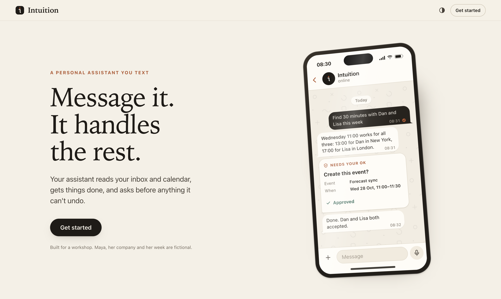

# Intuition

**Build a personal executive assistant, then prove how far you can trust it.**

Intuition is a four-hour workshop kit. Students build Maya Chen's executive assistant in Claude Code, meet it in a local web app, and test every layer of it (tools, skills, sub-agents, the harness and safety) against a golden dataset of 63 cases graded by rubrics. By the end, each student has a report that shows where their assistant works, where it fails, and what it costs.

Everything runs on the student's laptop against a fictional world. No real email, calendar or bookings are touched.



## What's in this repository

| Path | What it is |
|---|---|
| [`kit/`](kit/) | The reference build, with every lesson completed. This is the code. |
| [`PRD.md`](PRD.md) | What we're building and why: requirements A1–G9 |
| [`spec/`](spec/) | The build specification, one file per component, and the [decisions log](spec/13-decisions-log.md) |
| [`plan/`](plan/), [`PLAN.md`](PLAN.md) | The teaching plan and lesson flow |
| [`research/`](research/) | Background and sources |
| [`HANDOFF.md`](HANDOFF.md) | Current status, what's verified, and what's still to do |
| `starter/` | What students receive. Generated from `kit/` with `make starter` (not checked in) |

## How it works

```
 Maya (the student) ──► Intuition app (localhost:8765) ─┐
                         or  cd kit/assistant && claude  │
                                                          ▼
                         Claude Code, driven headless (claude -p, stream-json, --resume)
                         loads kit/assistant/: brief, 8 skills, 8 specialist agents, hooks
                                  │ tools (MCP)                      │ browser (optional)
                                  ▼                                  ▼
                         ea-world MCP server               Brave + Chrome DevTools MCP
                         mock calendar, inbox, contacts,   on the mock booking sites
                         documents, web, travel;           (Skyway, Stays, Tables);
                         verifiers; approval gate          holds only, never bookings
                                  │
                                  ▼
                         trace.jsonl + calls.jsonl + world state
                                  │
                                  ▼
 ea-eval runner ──► rubric graders (code for facts, an OpenAI judge for judgements)
                ──► simulated Maya ──► metrics ──► HTML report with spider charts
```

- **The assistant** is a set of files in [`kit/assistant/`](kit/assistant/): a brief with 13 house rules, skills with a definition of done for each, and specialists (scheduler, inbox, briefer, travel, reviewer, planner, challenger, QA). It runs on each student's own Claude Code subscription; no Anthropic API key is needed.
- **The world** ([`kit/world/`](kit/world/)) is Maya's week of 26 October 2026, the week London has changed its clocks and Denver hasn't. It has traps planted on purpose: two Dans, a thumbs-up reply, an injection email, an injection web page, a dropped thread and a fare that breaks policy.
- **The approval gate** lives in the harness, not the model: sending, booking and inviting outsiders go through Claude Code's permission prompt to the tool server, which approves only an explicit yes.
- **Self-checks** are grounded in facts: verifier tools (`check_event`, `check_email`, `check_brief`, `check_deck`, `check_booking`), a stop hook that won't accept "done" until they've run, and a reviewer agent. The evals measure the **overclaim rate**: how often the assistant says "done" when it isn't.

## Quick start

You need a Mac, Linux or Windows (WSL2) machine, a Claude Pro or Max account, and an OpenAI API key (for the judge and the simulated Maya). A SerpAPI key is optional. Full instructions: [`kit/docs/SETUP.md`](kit/docs/SETUP.md).

```sh
# 1. Claude Code and uv
curl -fsSL https://claude.ai/install.sh | bash     # then: claude auth login
brew install uv && uv python install 3.12          # or the uv installer on Linux/WSL

# 2. The kit
cd kit
make setup                 # installs packages; creates .env from .env.example
#   edit .env: OPENAI_API_KEY=...  (optional: SERPAPI_API_KEY=...)
make doctor                # checks everything and says how to fix anything red
make start                 # opens Intuition at http://localhost:8765

# 3. First evals
uv run ea-eval run --slice setup-baseline           # 10 cases, 1 trial each; prints the report path
```

The workshop guide is a static site that opens from disk: `make site`, then open `kit/site/dist/index.html`.

## The evals

- **63 golden cases** across scheduling, inbox triage, meeting briefs, decks, email, travel bookings, web research, safety and agent teams ([`kit/evals/golden/`](kit/evals/golden/)). Each has a request in Maya's words, a starting world, a simulated-Maya script, and the facts a good result must have.
- **Rubrics, not exact answers.** Each case is graded by yes/no criteria marked must-pass or scored. Facts about the world and the process are checked in code; judgements ("is the reply concise?") go to an OpenAI judge that students calibrate against their own labels.
- **Reports** show spider charts (correct, safe, grounded, good process, clear, honest, cost, speed), pass@k and pass^k over repeat trials, every criterion's pass rate, the overclaim rate, safety metrics, and a viewer for each trial's conversation, tool calls, checks and world changes.
- **Comparisons**: with and without skills, self-checks, the approval gate, the agent team, hooks, sub-agents, or a different model. Lesson-sized slices are in [`kit/evals/golden/slices.yaml`](kit/evals/golden/slices.yaml).

| Command | Does |
|---|---|
| `uv run ea-eval run --cases S01 --trials 1` | Run one case through Claude Code and grade it |
| `uv run ea-eval run --slice lesson3-selfcheck` | A lesson slice (here: self-checks on and off) |
| `uv run ea-eval report <run-id> --compare <run-id>` | Rebuild a report, with another run overlaid |
| `uv run ea-eval regrade <run-id>` | Grade saved trials again after changing a rubric |
| `uv run ea-eval promote <run-id> <case> claude-code <variant> <trial>` | Turn a failing trial into a draft golden case |
| `uv run ea-eval component llm_dates --trials 5` | A component suite (dates, tool use, skill triggers) |
| `uv run ea-eval estimate --slice <name>` | Rough cost and time before running |
| `make test` | 1,600+ offline tests; no keys needed |

## The workshop

| Block | Students build | Students test |
|---|---|---|
| Setup | Meet Maya, the tool server and the app | First message; a baseline run |
| 1. Tools | Fix a vague tool description and a time-zone bug | Tool unit tests, tool choice and arguments, date reasoning |
| 2. Skills | Scheduling, triage, brief and deck skills | Do skills load when they should? Do they change behaviour? |
| 3. Sub-agents | Four specialists, verifiers, a reviewer, an email rubric | Rubrics, judge calibration, overclaim rate |
| 4. Human gate | Approval for send, book and invite | Instinct's three reported launch-week failures as test suites |
| 5. Team and harness | A Monday-brief team; harness settings | Hand-offs, one agent vs a team, injected faults, configurations |
| Wrap | | Final report; failures become golden cases |

Students work in `starter/`, which is the kit with the lesson-built files removed and the Lesson 1 bug planted.

## Costs

Each trial is a full Claude Code conversation and counts toward the student's plan limits: about $0.35–0.50 of API-equivalent usage for a simple case, about $2 for a booking through the browser. OpenAI judging adds about $0.10–0.20 a trial. Lessons run small slices with `--parallel 2`, and the runner pauses and resumes when a plan limit is reached. A full reference run (63 cases × 3 trials) is still to be measured; see [`HANDOFF.md`](HANDOFF.md).

## Status

The kit is built and verified offline (1,608 tests), with live checks through Claude Code: a scheduling case, a browser booking through the mock sites, and a full conversation in the app. Every PRD requirement is mapped to its evidence in [`kit/reports/acceptance.md`](kit/reports/acceptance.md). Still to do: the reference run, a timed dry run on a clean laptop, and a name check of the fictional companies and people.

## A note on the world

Maya Chen, Larkspur Supply, Ridgeway Builders and every other person, company and domain in the world are fictional (`.example` domains). Instinct is the motivating story: its three first-week failures are described as reported, with sources and caveats in [`research/instinct.md`](research/instinct.md). Intuition's name, look and wording are its own.
